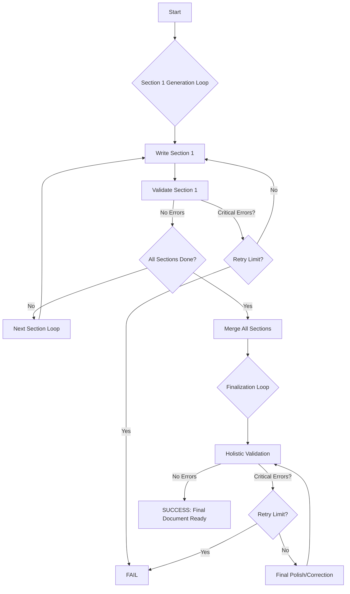

# AutoGen Document Assembly & Finalization Engine

This project showcases an advanced, multi-phase autonomous agent system built with Microsoft's AutoGen framework. It orchestrates a complex workflow to generate, validate, and polish documents from source materials, ensuring a high degree of quality and consistency.

The system follows a three-phase workflow:

1.  **Sectional Generation**: A specialized team of agents builds the document section by section. Each section is created and then immediately passed to a validation team.
2.  **Iterative Correction**: If a section fails validation, it enters a correction loop. The writer team receives specific feedback and refines the section until it meets the quality criteria.
3.  **Finalization & Polishing**: Once all sections are successfully created, they are merged into a single document. A new, specialized "finalization team" performs a holistic review to ensure consistency, remove duplication, and polish the entire document, again using an iterative correction loop.

## High-Level Workflow



## Key Features

-   **Specialized Agent Teams**: Employs distinct teams for initial content creation (`Writer Team`) and final polishing (`Final Writer Team`), each with tailored instructions and capabilities.
-   **Phase-Based Validation**: Uses separate validation teams for sectional content (`Validator Team`) and holistic review (`Final Validator Team`).
-   **Sequential & Iterative Processing**: Combines a section-by-section build process with feedback-driven correction loops to ensure quality at every stage.
-   **Comprehensive Logging**: Generates two timestamped log files for each run:
    -   `full_run_[timestamp].log`: Captures the **entire terminal output**, including every detailed message between agents, for complete traceability.
    -   `loop_trace_[timestamp].log`: A high-level log of key milestones, iteration results, and a final summary.
-   **Performance & Cost Tracking**: The loop trace log concludes with a summary of total execution time, total tokens used (prompt vs. completion), and the estimated API cost.
-   **Robust Error Handling**: Automatically handles API rate limits (`429` errors) and transient API failures using `litellm`'s built-in exponential backoff.
-   **Tool-Augmented Agents**: Agents are equipped with tools to read source PDFs, read/write Markdown files, and manage the filesystem.

## Project Structure

```
.
├── docs/               # Input: Place your source PDF documents here.
├── instructions/       # Input: Guidance files for all agent teams.
│   ├── writer_guidance_s1.md
│   ├── validation_guidance_s1.md
│   ├── ...
│   ├── writer_guidance_final.md
│   └── validation_guidance_final.md
├── logs/               # Output: Contains all generated log files.
├── outputs/            # Output: Generated documents and feedback reports.
├── .env                # Input: Your secret API keys and endpoints.
├── .gitignore          # Specifies files and folders for Git to ignore.
├── main.py             # Main application entry point and orchestrator.
├── writer.py           # Defines the sectional and final writer teams.
├── validator.py        # Defines the sectional and final validator teams.
├── utils.py            # Contains shared tool functions and utilities.
└── README.md           # This file.
```

## Getting Started

### 1. Prerequisites

-   Python 3.10+
-   An Azure OpenAI account with at least two model deployments (a primary model and your specialist "o3" model).
-   Git for cloning the repository.

### 2. Installation

1.  **Clone the repository:**
    ```bash
    git clone <your-repository-url>
    cd <repository-folder-name>
    ```

2.  **Create and activate a virtual environment:**
    ```bash
    python -m venv venv
    source venv/bin/activate  # On Windows: `venv\Scripts\activate`
    ```

3.  **Install dependencies:**
    ```bash
    pip install -r requirements.txt
    ```

### 3. Configuration

1.  **Create your `.gitignore` file** and populate it with standard Python/IDE ignores, and most importantly, `.env`, `logs/`, and `outputs/`.

2.  **Set up your API Keys in `.env`:**
    Create a file named `.env` in the project root. Use the following structure and fill in your Azure credentials.

    ```ini
    #  Model Credentials (e.g., GPT-4)
    AZURE_OPENAI_API_KEY="YOUR_PRIMARY_API_KEY"
    AZURE_OPENAI_ENDPOINT="https://YOUR_PRIMARY_ENDPOINT.openai.azure.com/"
    AZURE_OPENAI_MODEL_NAME="YOUR_PRIMARY_DEPLOYMENT_NAME"
    AZURE_OPENAI_API_VERSION="2023-07-01-preview"

    ```

3.  **Add Source Documents:** Place your source PDF files into the `docs/` directory.

4.  **Review Guidance:** The behavior of all agents is controlled by the Markdown files in the `instructions/` folder. Review and edit these to match your project's specific requirements.

## How to Run the Application

Execute the entire workflow with a single command from the project's root directory:

```bash
python main.py
```

-   **Monitor Progress:** Watch the agent conversations unfold in your terminal.
-   **Check Outputs:** Find the sectional (`output_sX.md`), final (`final_document.md`), and feedback files in the `outputs/` folder.
-   **Review Logs:** For a full transcript of the run, check `full_run_[timestamp].log`. For a high-level summary, including performance metrics, check `loop_trace_[timestamp].log`.
